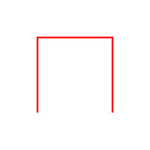

### Notes

An algorithm that is more efficient and works in arbitrary dimensions without relying on awkward
recursions and geometry alignment is described in
[John Skilling; Programming the Hilbert curve. AIP Conf. Proc. 21 April 2004; 707 (1): 381–387](https://doi.org/10.1063/1.1751381).

### Overview

This repository contains recursion-based implementation of Hilbert Curve sorting algorithms for
$R^2$ and $R^3$ in C++ and TypeScript.

### Motive

Sorting, by intuition, gives an ordering of a set where the distance between neighboring elements is
minimized. It is heavily used for DB indexing, visualization and a myriad of other purposes.

> The distance may be measured in Hamming Distance for bits, or Euclidean 2-norm for vectors.

Sometimes our data is multidimensional, like RGB colors { $(r, g, b) | r, g, b \in [0, 255]$ }, or
vectors in $R^n, n \gt 1$. Unlike the real numbers, we face challenges to sort data in higher
dimensions.

The simplest sort one might use is the Lex Order, which compares the first non-identical component
of tuples, but this approach has many flaws.

> Just take $[00, 01, 10, 11]$ as an example, Lex Order will return the original sequence, which
> fails to minimize element-wise Hamming Distance.  
> A better ordering is $[00, 01, 11, 10]$, which is the Gray Code sequence $G_2$.

### Solution

Mapping from $R^n$ to $R$ could be achieved through the inverse of Hilbert Curves, which are
space-filling curves whose limit is an n-hypercube.

> Technically Hilbert Curves map the unit interval $[0, 1]$ to the unit n-hypercube $U_n$, but the
> hypercube could be offsetted and scaled to fit our data.

Neighboring tuples in the input space would also end up close to each other on Hilbert Curves,
preserving the spatial relationship between the input points.

### Implementation

Some key properties of the Hilbert Curves that allows us to implement a recursive algorithm:

#### Locality-preservation

Points on the Hilbert Curve converges to a definite point as iteration count increases.

> This is in general not true for other curves, where the resulting points might shift vastly over
> iterations.

#### Fractalness

Every iteration $H(n)$ implicitly traces $H(n-k), k \le n$ curves.

>  >
>  >
>   
> H_2 Overlay, First 3 Iterations  
> Images by Geoff Richards (Qef) - Own work, Public Domain

---

Now, take the $U_2$ case as an example for simplicity of illustration.

Divide $U_2$ into 4 quadrants, denoted by $[00, 01, 11, 10]$ respectively (the 1st bit represents if
$x \gt 0.5$ and the 2nd, $y \gt 0.5$). Notice, by the fractalness of the curve, no matter how high
the iteration count (even at $\infty$), points in $01$ always come after ones in $00$, and ones in
$11$ always come after ones in $01$, and so on.

> The orientation of $n$-D Hilbert Curve is based off the Gray Code sequence $G_n$, generalizing the
> interpretation of the bits as mentioned above.  
> This is intuitive as the Gray Code is a permutation of the Bit Code, which contains every vertex
> of $U_n$.

This allows us to recursively divide points into quadrants and sort the quadrants instead, after
which we concatenate the results in $H_2(1)$ order. Before sorting the quadrants, they must be
rotated or flipped and offsetted to fit $H_2(1)$, as the recursive algorithm divides the square
according to it.

The recursion base is when there are only 1 or none vector left, or if all vectors are identical.
The input vectors would be returned.

The recursion step would offset and scale the vectors to fit a hypercube, recurse, and return
de-fitted result vectors.

The $U_3$ case is essentially the same.

### Demo

An interactive demo is available at
[Hilbert Curve Sort](https://carbonicsoda.github.io/hilbert-curve-sort/). It contains demos of:

#### 2D Points Sorting

Connects 2D points according to the sorted sequence.

> Notice sorting random points would roughly approximate a Hilbert curve.

#### RGB Colors Sorting

Sort colors with $(R, G, B)$ as the color vector, with a pre-/post-sort comparison.

> The result would be more gradient-like than the original version.

### Notes

Time complexity of the algorithms is estimated to be $O(n)$ where n is the number of vectors in the
hypercube.  
(complexity analyzed w.r.t. the number of total function calls)

Space complexity of the algorithms is expected to be high as recursion is heavily used.

> Here the complexities are estimated assuming uniform distribution of points in $U_n$.

However, since recursion is highly optimized in modern engines, we could safely ignore the drawbacks
when sorting a reasonable amount of points.

### Notes

The algorithms could be used for fast approximations of the Travelling Salesman Problem. See
[Details, Benchmark, and Visualization](https://github.com/CarbonicSoda/tsp-hilbert-curve-benchmark).
